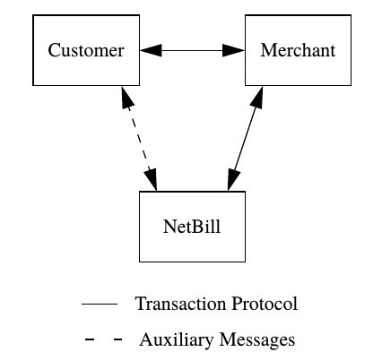
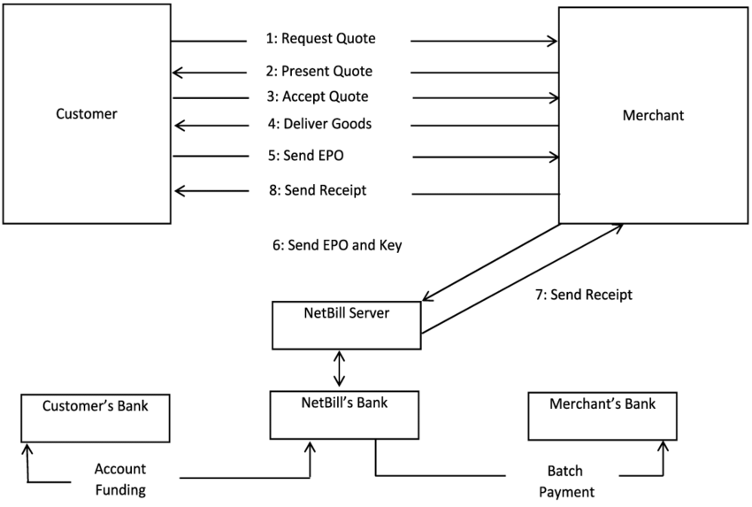

# Netbill Transaction Protocol Simulator

## NetBill Protocol in Theory

**What is NetBill?**

NetBill is a system for micropayments for information
goods (digital commodities) on the Internet.
A customer, represented by a client computer, 
wishes to buy information from a merchant’s
server. An account server (the NetBill server), maintains
accounts for both customers and merchants, linked to
conventional financial institutions. A NetBill transaction
transfers information goods from merchant to customer,
debiting the customer’s NetBill account and crediting
the merchant’s account for the value of the goods. When
necessary, funds in a customer’s NetBill account can be
replenished from a bank or credit card; similarly, funds
in a merchant’s NetBill account are made available by
depositing them in the merchant’s bank account.

NetBill requires an efficient set of protocols to
support price negotiation, goods delivery and payment.

**The NetBill Transaction Model**

The NetBill transaction model involves three parties:
the customer, the merchant and the NetBill transaction
server. A transaction involves three phases: price
negotiation, goods delivery, and payment.

**Transaction Objectives** 

For a NetBill transaction, we have the following set of
objectives. 

a) Only authorized customers can charge against a
NetBill account.

b) The customer and merchant must agree on the item
to be purchased and the price to be charged.

c) A customer can optionally protect her identity from
merchants.

d) Customers and merchants are provided with proof
of transaction results from NetBill.

*In addition, we have the following objectives to support
price negotiation and goods delivery.*

e) There is an offer and acceptance negotiation phase
between customer and merchant.

f) A customer may present credentials identifying her
as entitled to special pricing or treatment.

g) A customer receives the information goods she purchases if and only if she is charged (and thus the
merchant is paid) for the goods.

h) A customer may need approval from a fourth
(access control) party before the NetBill server will
allow a transaction.

*Finally, we add as a general objective for all phases of
the purchase process:*

i) The privacy and integrity of communications is
protected from observation or alteration by external
parties.

**Transaction Protocol Overview**

In the price negotiation phase, the customer
presents evidence of her identity, and (optionally)
supplemental credentials, and requests a price quote on
an item. The customer may also include a bid for the
item. The merchant responds with a price offer.

In the second phase, the customer accepts or
declines the offer. In the case of information goods,
acceptance constitutes an order for network delivery.
The merchant provisionally delivers the goods, under
encryption, but withholds the key.

Key delivery is linked to completion of the third
phase, the payment protocol. In this phase, the customer
constructs, and digitally signs, an electronic payment
order (or EPO) and sends it to the merchant. The
merchant appends the key to the EPO and endorses
(digitally signs) the EPO, forwarding it to the NetBill
server. The NetBill server returns a digitally signed
receipt, which includes the key, to the merchant, who
forwards a copy to the customer.

1. C ⇒ M Price request
2. M ⇒ C Price quote
3. C ⇒ M Price quote Goods request
4. M ⇒ C Goods, encrypted with a key K
5. C ⇒ M Signed Electronic Payment Order
6. M ⇒ N Endorsed EPO (including K)
7. N ⇒ M Signed result (including K)
8. M ⇒ C Signed result (including K)

## Implementation Of NetBill Protocol

In this project me ([Navid Malek](https://www.linkedin.com/in/navid-malek-b9bb6b128/)) and my fellow friend [Reza Rahimi](https://www.linkedin.com/in/reza-rahimi-883b61167/) implemented most of NetBill transaction protocol, including:

- Transaction Protocol

*Paper Sections*

3.2. The Price Request Phase

3.3. The Goods Delivery Phase

3.4. The Payment Phase

+ Error recovery (Not enough balance, Courruption, No access, etc.)

- Pseudonyms Protocol

*Paper Sections*

4.2. Pseudonyms

- Access Control Mechanism

Mini Access contol app not According to paper

## Code and Files Explanation

TicketGenerator.py ==Written by Navid==> Generating MIT Kerberos ticket for merchant or netbill server

Pseudonyms.py ==Written by Navid==>  Pseudonym phase

AccessControl.py ==Written by Navid==> AccessControl mini App

